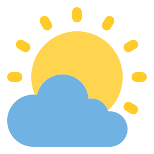

#  Solar Illuminance Sensor

Creates a `sensor` entity that estimates outdoor illuminance based on either sun elevation or time of day.
In either case, the value can be further adjusted based on current weather conditions obtained from another, existing entity.
The weather data can be from any entity whose state is either a
[weather condition](https://www.home-assistant.io/integrations/weather/#condition-mapping)
or a cloud coverage percentage.

Supports configuration via YAML or the UI.
